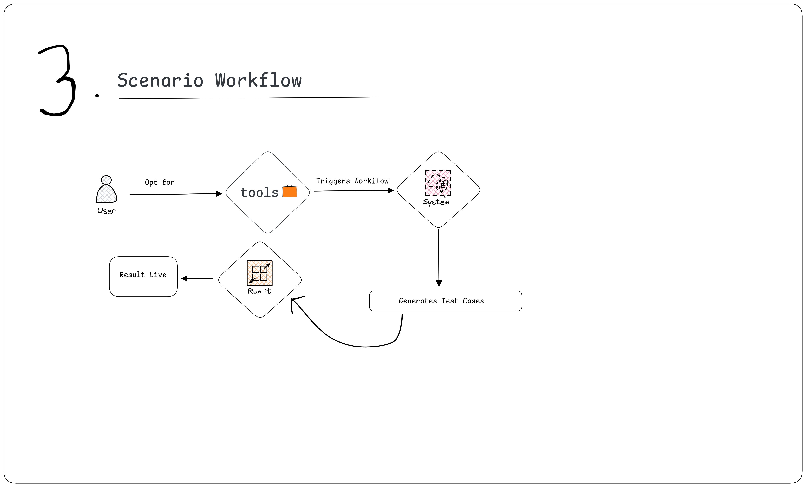
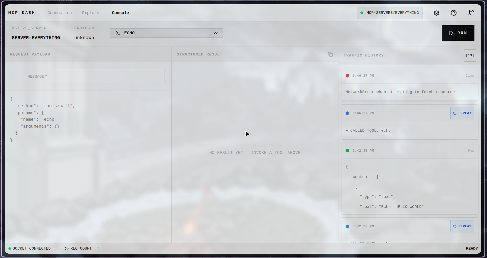

### About

1. Full Name - Gaurav Kumar
2. Contact info (public email) - gauravk16in@gmail.com
3. Discord handle in our server (mandatory) - @tendsgaurav
4. Home page (if any) - https://gauravk.space
5. Blog (if any) - NA
6. GitHub profile link - https://github.com/gauravk16in
7. Twitter, LinkedIn, other socials - https://linkedin.com/in/tendsxgaurav
8. Time zone - GMT +5:30 , Asia/Kolkata
9. Link to a resume (PDF, publicly accessible via link and not behind any login-wall) - https://drive.google.com/file/d/1qe3h9zHNJquehfqGAZXAFbnvIgcZl0mq/view?usp=sharing

### University Info

1. University name - R.N.S Institute of Technology, Bangalore
2. Program you are enrolled in (Degree & Major/Minor) - B.E in Computer Science and Engineering
3. Year - 2nd Year
4. Expected graduation date - 2028

### Motivation & Past Experience

Short answers to the following questions (Add relevant links wherever you can):

1. Have you worked on or contributed to a FOSS project before? Can you attach repo links or relevant PRs?
Yes, earlier I have worked on API DASH which is a FOSS project here is my links of contributions to API DASH -
https://github.com/foss42/apidash/issues/1021#issuecomment-3757801171
https://github.com/foss42/apidash/issues/1363#issuecomment-4093068441
https://github.com/foss42/apidash/issues/1382#issuecomment-4108232229

2. What is your one project/achievement that you are most proud of? Why?
If I have to decide one project that I'm most proud of then it will be GlimpseIO. When I first came to college I mostly use to go to library and badmintion court initially becuase I like coding and plaing badmintion that time but going to library  with my Nitro 5 and coming back to my room just after realizing the library was closed feels me very tired and wasting of time specially when it's afternoon and same for the badmintion going to the court and waiting for my turn feels me like hope so I came at this time so I have to wait less and enjoy more the gameplay.
Then, I made GlimpseIO (Glimpse means at the moment and IO means In and Out) and the aim was straight forward know about any place before you go there. How it's was working- I stick a QR code on the library gate so when the gatekeeper comes and open the library he scan the qr code and the update changes to Library Open with timestamp and when it's closes they scan again and it automatically detect the timestamp and mark as Library Closed. Same happend for Badmintion when somebody was playing they scan the QR and it automatically detect the badmintion QR and mark as Already occupied and so on.
Later I did same thing for Cafeteria where each worker has assigned to their QR code and they update about the meal stocks, capacity of the Cafeteria, and everything that was possible to do and felt important at that moment.
Now almost everyone from my class started using GlimpseIO and others loved it too and then I added support to get notified via Whatsapp and started adding more busy places where the integration was essential.
And, a day my professor saw the QR code as I had sticked on the gate of Cafeteria and he contacted me & said how you got this idea? This is an amazing work you have done Gaurav! since I was in first year that time he appreciated me to solve a real problem almost everyone was facing. They also offered me to upgrade it and automate with integrating IOT, and AI.and Yes! this Glimpse moment I will never forget.

3. What kind of problems or challenges motivate you the most to solve them?
Mostly, I like to solve those problems which I start to face repeatively again and again. I try to fix it by iterating suitable approaches and researching on exisitin solution if any exit on the internet.
For eg. currently, I'm working with a automatic smart BIN system that catches any garbage by sensing your hand gesture.
I'm working with a team and we're trying to make it helpful for lazy peoples, and also adding humour to the BIN to make it playful.
So, I like to solve these types of problems which can help others and make their day better.

4. Will you be working on GSoC full-time? In case not, what will you be studying or working on while working on the project?
Yes! I will be working on GSoC full-time however I maybe limited to work for a week of two due to my university semester exams.

5. Do you mind regularly syncing up with the project mentors?
Not at all, I will love to connect with them and ask for any feedbacks and helps I needed during those time.

6. What interests you the most about API Dash?
For me API Dash is not just like another API testing platform as I learned alot during my contributions and exploration of this project and It made understand alot things I never aware of like playing a video in the API DASH and get to know why the app crashed last time and why not this time in flutter, get to know MIME pkg, Possibilities of ASCII values in indentifying the binary file types and list goes on. My first issue I raised was #1021 in API DASH.

7. Can you mention some areas where the project can be improved?
I think following areas can improve API DASH and make it more interesting.
-Adding a how to use Guide for begineers.
-Adding a feature to compare multiple previous API calls.
-Adding a Response Previewer for Binary or Unknown file type.
-Adding a console to fetch and shows logs in the UI.

8. Have you interacted with and helped API Dash community? (GitHub/Discord links)
https://github.com/foss42/apidash/issues/1021#issuecomment-3757801171
https://github.com/foss42/apidash/issues/1363#issuecomment-4093068441
https://github.com/foss42/apidash/issues/1382#issuecomment-4108232229

### Project Proposal Information

1. Proposal Title - MCP Dash: Building a Testing and Debugging Suite for Model Context Protocol

2. Abstract: A brief summary about the problem that you will be tackling & how.
MCP servers are getting more popular and even becoming the API layer of AI agents. While identifying the bugs, and getting to know why Claude is hallucinating on calling a tool is very difficult and developers often faces this problem. 
-Model Context Protocols's offical inspector tool is stateless and loses every connections and it's log on each restart or refresh. (Using IndexedDB to store the prev session data and reuse it into the next session)
-The History Panel is not promising the developer what they want, for eg. one cannot go back to previous tool call untill and unless he or she enter the required argument. (Adding a replay button can reduce the workload)
-Getting the raw and unexpected JSON-RPC message creates confusion amoung the developer and consume their time to find the actual probelm. (beautifying the JSON and rendering a more readible output)
-Errors are undifferentiated, they need to be classified. (Setting a colorful tag with error type can help determine the actual error type.)

3. Detailed Description

1.**Restore previous session on disconnection**
localStorage keeps data only in useState which get clears on every refresh, and developer need to repeat the tool calling by giving the arguments required and this leads to frustration.
While using IndexedDB can fix this problem by acting as a persistent, client-side database that can survive browser refresh.
also IndexedDB is async, it supports structured queries, and doesn't block rendering like localStorage and avoids unexpected freezes.

2.**Extended Traffic Controller**
-Traffic Panel (Logs) helps in determining the exact timestamps, latency of a tool call.
-The purpose is to capture the logs with progress token (When a `tools/call` has a `progressToken`, show a live progress bar
in the Tools panel that updates as notifications arrive) and handle way better than existing history or traffic handler by parsing the MCP communication between client and server. It can be able to fetch the history of requests and responses between client and server in better and structured form. It helps developer understand better what exactly went wrong, which field failed and why.
-It follows FIFO rule (first in first out) if counts exceeds the MAX_ENTRIES. so that it keeps the storage bounded
and avoids prewrites overhead on every insert.
-Adding a replay↵ button can helps in repeating the previous actions performed.
One can replay any `tools/call` by clicking on the replay↵ button from the log history.

3.**Scenario Workflow**
Design a scenario workflow to streamline the execution and validation of testing scenarios. It enables developers to trigger specific test suites using tool name selectors, or any other to monitor real-time execution results, and systematically diagnose failures. It can work by integrating validation checks and environment variable verification. 

4.**Identify and Categorizes Every Error**
Add a simple classification layer that categorizes each error to exactly one of three layer based on the JSON RPC error code & method context.
The classification can be displayed with a colored tag next to each error entry in the traffic panel.
eg. `[TRANSPORT]`, `[PROTOCOL]`, `[TOOL-EXEC]`

5.**Preflight validation**
Submitting a tool call with a missing required field. It can be a string value below `minLength`, or a number above `MAX`
gives an inline error under each field before any network requests is made.
The validator runs against the tool's `inputSchema` before `makeRequest` is called.

4. Weekly Timeline: A week-wise timeline of activities that you would undertake.
Starting with setting up the development environment, study the latest MCP Inspector architecture, and discuss the final words and scope with my mentor.

Week 1

Understand and document the current request lifecycle, tool invocation flow, and history logging behavior in the inspector.
Identify extension points for persistence, replay, and error tagging.

Week 2

Design and build the session persistence layer using IndexedDB to store connections, tool calls, responses, and notifications. 
Define storage limits and a strategy for removing old data with bounded FIFO history.

Week 3

Restore previous sessions when reloading or disconnecting. This includes saved requests, responses, and connection metadata. 
Add migration and fallback logic as needed to ensure the persisted state is loaded safely.

Week 4

Create an improved traffic and history panel that structures and displays requests and responses. Include formatted JSON, readable grouping, timestamps, and latency information for MCP communication.

Week 5

Add replay support for previous tool calls so developers can rerun requests directly from history. Ensure previous arguments and integrates well with existing tool forms.

Week 6

Implement live progress handling for tool calls that use progressToken. Show progress updates in the Tools and Traffic panels. Enhance history entries to make request status transitions clear.

Week 7

Add error classification and visual tags for [TRANSPORT], [PROTOCOL], and [TOOL-EXEC] using JSON-RPC error codes and request context. Improve error display so failures are easier to scan and debug.
and 

Week 8

Implement preflight validation for each tool’s inputSchema before sending a request. Show inline validation errors for missing required fields, invalid lengths, and out-of-range values.

Week 9

Design and create the Scenario Workflow feature to define repeatable tool-driven testing sequences. Include validation and environment checks within scenarios so developers can run structured debugging flows.

Week 10

Refine the scenario execution view with better result reporting, failure summaries, and step-by-step diagnostics. Improve usability, loading indicators, and how empty or error states are displayed across the new UI.

Week 11

Write unit and integration tests for persistence, replay, validation, and error classification. Address bugs based on mentor feedback and test results.

Week 12

Complete documentation, demo video, and final UI adjustments. Prepare the final pull requests, usage guide, and handoff notes for maintainers.

**Initial UI Mockup**

